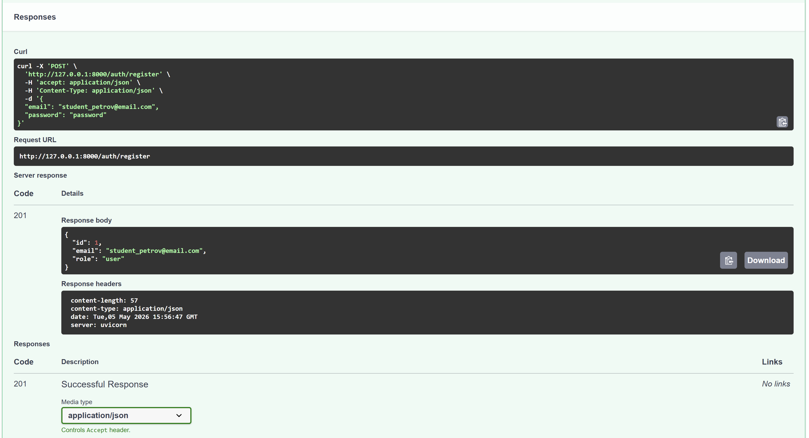
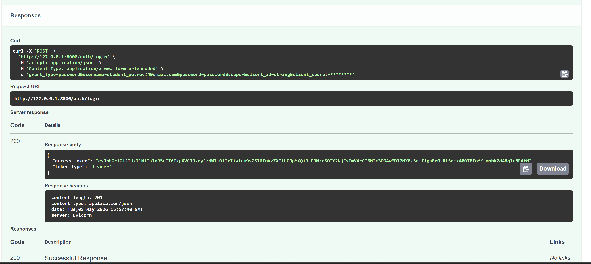
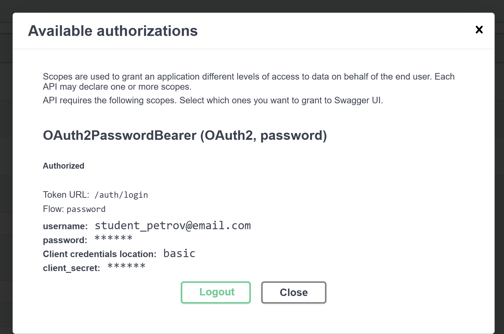
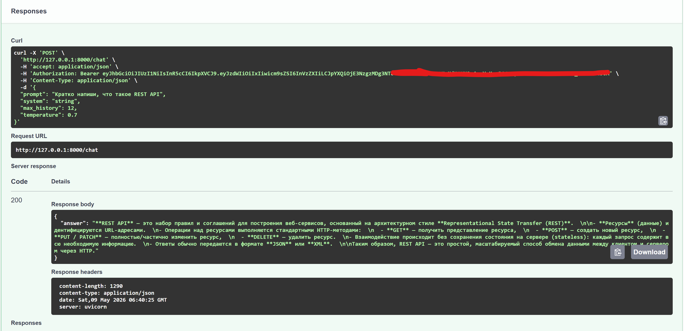
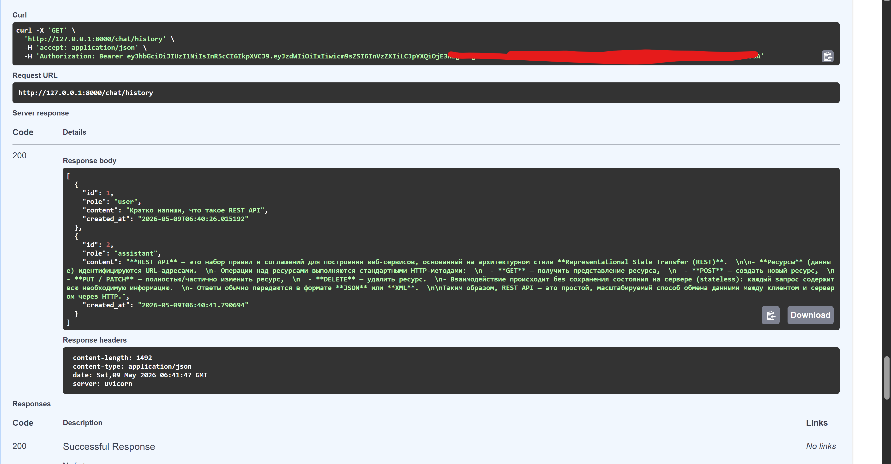
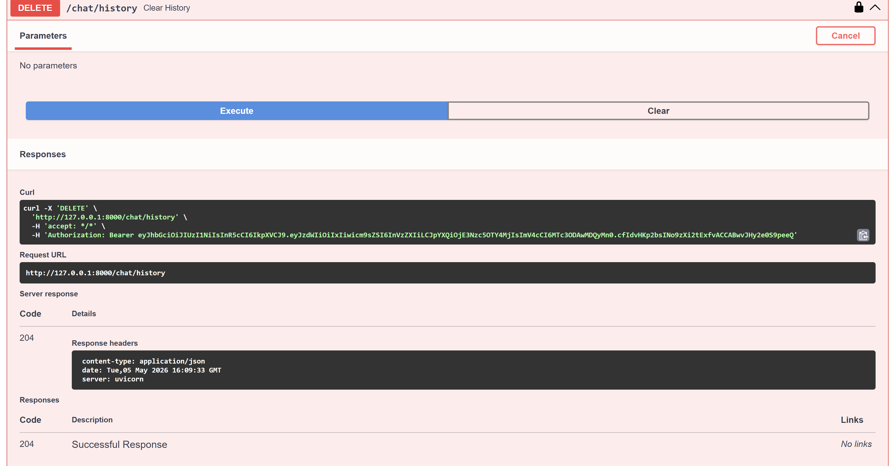
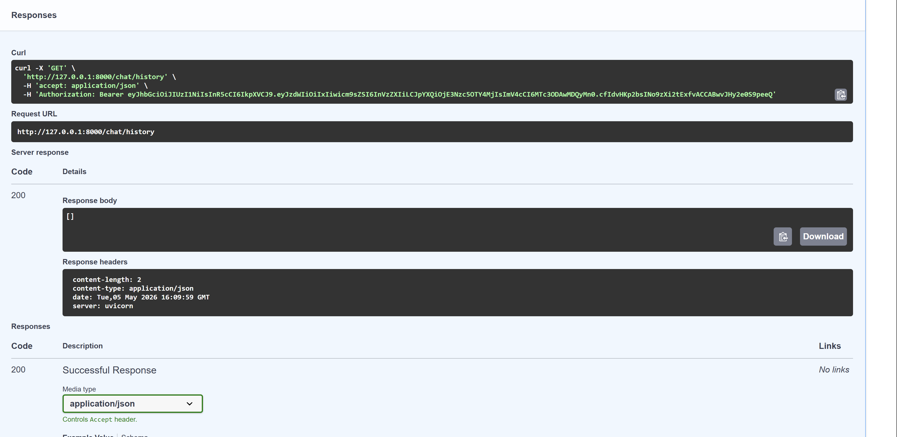

# llm-p

FastAPI-сервис с JWT-аутентификацией, SQLite и проксированием запросов к LLM через OpenRouter.

## Возможности

- Регистрация, логин и получение JWT access token.
- Защищенные эндпоинты через OAuth2 Bearer (кнопка Authorize в Swagger).
- Отправка запроса в LLM через OpenRouter.
- Сохранение истории диалога в SQLite по каждому пользователю.
- Очистка истории текущего пользователя.

## Структура проекта

```text
llm-p/
├── pyproject.toml                 # Зависимости проекта (uv)
├── README.md                      # Описание проекта и запуск
├── .env.example                   # Пример переменных окружения
├── screenshots/                   # Скриншоты демонстрации эндпоинтов
│
├── app/
│   ├── __init__.py
│   ├── main.py                    # Точка входа FastAPI
│   │
│   ├── core/                      # Общие компоненты и инфраструктура
│   │   ├── __init__.py
│   │   ├── config.py              # Конфигурация приложения (env → Settings)
│   │   ├── security.py            # JWT, хеширование паролей
│   │   └── errors.py              # Доменные исключения
│   │
│   ├── db/                        # Слой работы с БД
│   │   ├── __init__.py
│   │   ├── base.py                # DeclarativeBase
│   │   ├── session.py             # Async engine и sessionmaker
│   │   └── models.py              # ORM-модели (User, ChatMessage)
│   │
│   ├── schemas/                   # Pydantic-схемы (вход/выход API)
│   │   ├── __init__.py
│   │   ├── auth.py                # Регистрация, логин, токены
│   │   ├── user.py                # Публичная модель пользователя
│   │   └── chat.py                # Запросы и ответы LLM
│   │
│   ├── repositories/              # Репозитории (ТОЛЬКО SQL/ORM)
│   │   ├── __init__.py
│   │   ├── users.py               # Доступ к таблице users
│   │   └── chat_messages.py       # Доступ к истории чатов
│   │
│   ├── services/                  # Внешние сервисы
│   │   ├── __init__.py
│   │   └── openrouter_client.py   # Клиент OpenRouter / LLM
│   │
│   ├── usecases/                  # Бизнес-логика приложения
│   │   ├── __init__.py
│   │   ├── auth.py                # Регистрация, логин, профиль
│   │   └── chat.py                # Логика общения с LLM
│   │
│   └── api/                       # HTTP-слой (тонкие эндпоинты)
│       ├── __init__.py
│       ├── deps.py                # Dependency Injection
│       ├── routes_auth.py         # /auth/*
│       └── routes_chat.py         # /chat/*
│
└── app.db                         # SQLite база (создаётся при запуске)
```

## Установка через uv

1. Установить `uv`:

```bash
pip install uv
```

2. Создать venv:

```bash
uv venv
```

3. Активировать окружение:

```bash
# Windows
.venv\Scripts\activate.bat

# macOS/Linux
source .venv/bin/activate
```

4. Установить зависимости:

```bash
uv pip install -r <(uv pip compile pyproject.toml)
```

На Windows PowerShell:

```powershell
uv pip compile pyproject.toml -o requirements.txt
uv pip install -r requirements.txt
```

## Настройка .env

Скопируйте `.env.example` в `.env` и заполните `OPENROUTER_API_KEY`
Замените модель на доступную для аккаунта при необходимости

## Запуск

```bash
uv run uvicorn app.main:app --reload --host 0.0.0.0 --port 8000
```

Swagger: <http://127.0.0.1:8000/docs>

## Проверка линтера

```bash
uv run ruff check
```

Ожидаемый результат:

```text
All checks passed!
```

## Демонстрация работы (скриншоты)


### 1) Регистрация пользователя



### 2) Логин и получение JWT



### 3) Авторизация через Swagger



### 4) POST /chat



### 5) GET /chat/history



### 6) DELETE /chat/history



### 7) GET /chat/history после очистки

